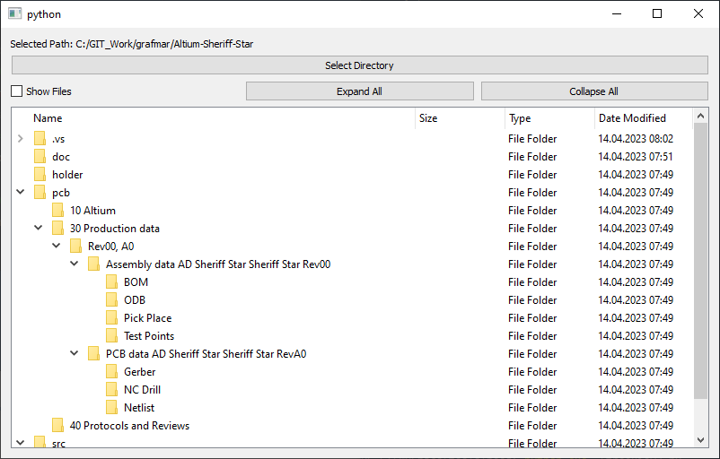
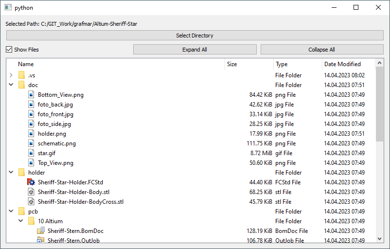

# treeView

This python script is generated using ChatGPT

I looked for a tool to display directories and files. I saw an example using
PyQT5 and had some ideas, so I asked ChatGPT to generate the code ;-)

 

## Download
[Precompiled executable](treeView.exe)

## SW-Requirements
* [Python](https://www.python.org/) (V 3.7.3 used)

### The PyQt5 package has to be installed using:
`pip install PyQt5`

### To create a standalone executable you can use pyinstaller
`pip install pyinstaller`
`pyinstaller.exe --onefile --windowed .\treeView.py`

## Description of the code given by ChatGPT
1. First, we import the necessary modules from PyQt5:
2. Next, we define a class called DirTreeView that inherits from QWidget. This class represents the main window of the GUI and contains all the widgets and functionality.
3. In the __init__ method of the DirTreeView class, we create a QFileSystemModel object, which will be used to display the directory tree. We also create a boolean flag called filter_directories_only, which determines whether to show only directories or both directories and files in the tree view. By default, we set this flag to True, so that only directories are displayed.
4. We create a QTreeView widget, which is used to display the directory tree. We also create a QLabel widget, which will be used to display the selected directory path. We create a QPushButton widget to allow the user to select a directory using a file dialog. We create a QCheckBox widget to allow the user to toggle between showing only directories or both directories and files in the tree view. Finally, we create two more QPushButton widgets to allow the user to expand or collapse all folders in the tree view.
5. We create a horizontal layout to hold the expand/collapse buttons and the checkbox.
6. We create a vertical layout to hold the label, select directory button, expand/collapse buttons and checkbox, and the tree view. We add all the widgets to this layout, and then set it as the main layout for the DirTreeView widget.
7. We initialize the file system model and tree view to show all available drives. We set the size of the first column of the tree view to 450 pixels, and resize the widget to the desired size.
8. We define a method called update_filter that updates the filter used by the file system model to show or hide files based on the checkbox state. If the checkbox is checked, we show both directories and files. If the checkbox is unchecked, we show only directories.
9. We define a method called select_directory that shows a file dialog to allow the user to select a directory. If the user selects a directory, we update the file system model and tree view to show the selected directory path, and update the path label to display the selected directory path.
10. Finally, we create an instance of the DirTreeView class and show it using the QApplication.exec_() method. This starts the event loop and shows the GUI to the user.

## Author
[Marco Graf](https://github.com/grafmar)
